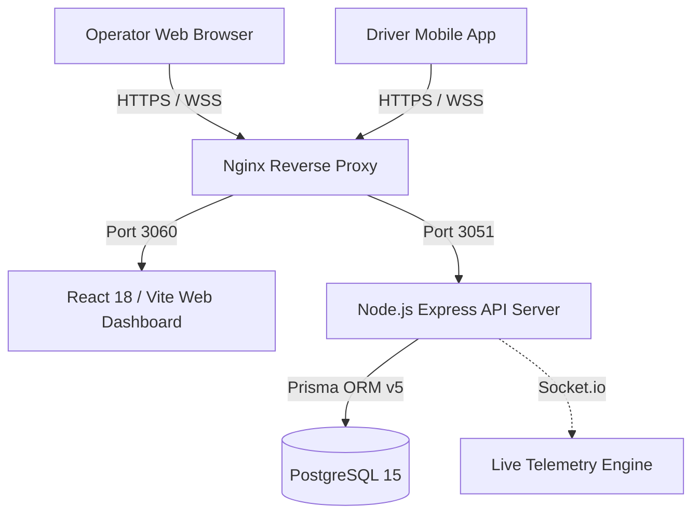
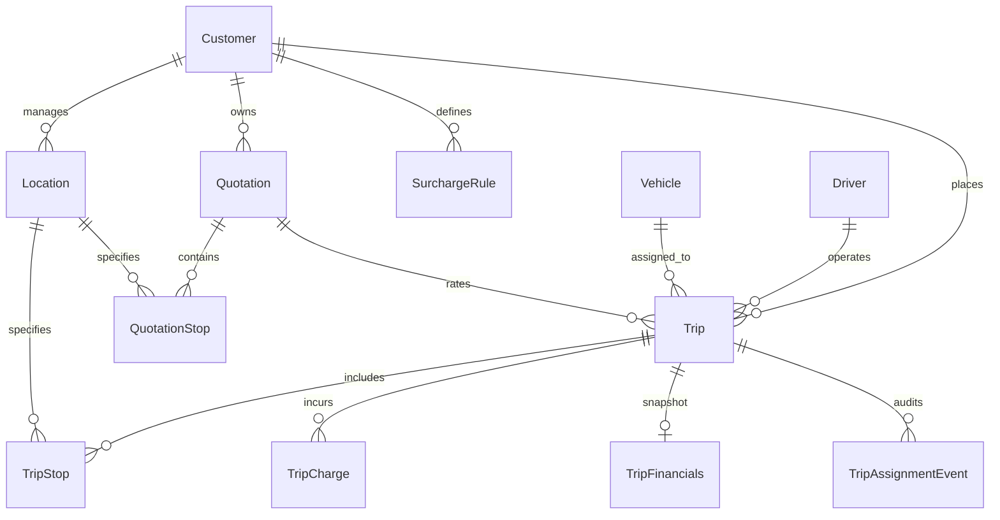

# MERCON Logistics Operating System — Technical Requirements Document (TRD)

**Version**: 2.0 (Unified Technical Architecture)  
**Date**: September 2026  
**Repository**: `Mercon` | **Primary Push Branch**: `origin/ilan`  
**Containerized Host Port**: `3051` (API) | `3060` (Web Dashboard)  

---

## 1. System Topology & Architecture

The MERCON platform is built as a microservices-lite, decoupled web and mobile architecture:



### 1.1 Web Dashboard (`frontend/web-dashboard`)
- **Framework**: React 18, Vite.
- **State Management**: TanStack React Query v5 (server state caching, optimistic updates).
- **Routing**: React Router v6 with protected route wrappers (`AuthContext`).
- **Styling**: TailwindCSS with MERCON custom theme system (`#FA634E`, `#3E3C3D`, `#EEF1F6`).
- **Components**: Customized shadcn/ui primitives.

### 1.2 API Server (`backend/api-server`)
- **Runtime**: Node.js v20+, Express.
- **Language**: TypeScript (Strict Mode enabled).
- **Database ORM**: Prisma ORM v5 with PostgreSQL driver.
- **Authentication**: Stateless JWT with role-based guard middleware.
- **Host Binding**: strictly bound to `0.0.0.0` for Docker container network access.

### 1.3 Telemetry & WebSockets Engine
- **Protocol**: Socket.io over Express HTTP server.
- **Frequency**: Driver mobile location update emitted every 10 seconds.
- **Events**: `driver:location_update`, `operator:subscribe_trip`, `operator:location_broadcast`.

---

## 2. Database Architecture & Schema ERD

The database schema is managed via Prisma ORM (`backend/api-server/prisma/schema.prisma`).

### 2.1 Entity Relationship Core



### 2.2 Core Models Breakdown

1. **`User`**: Authentication, role assignment (`SuperAdmin`, `Admin`, `Operator`, `Driver`), audit linkage.
2. **`Customer`**: Client profile, payment terms, WhatsApp metadata, driver workflow configuration.
3. **`Driver`**: Profile, license expiry, primary assigned vehicle link, mobile device tokens (`DriverDevice`).
4. **`Vehicle`**: Vehicle plate, asset type, trailer details, ICCES hardware ID (`icces_device_id`), last telemetry coordinates.
5. **`Trip`**: Core operational record. Status state machine (`Scheduled`, `Loading`, `InTransit`, `Delayed`, `Completed`, `Invoiced`, `Cancelled`).
6. **`TripStop`**: Multi-leg route stops with planned/actual timestamps, coordinate precision, and operator delay reasons (`delay_reason`).
7. **`Quotation`**: Commercial rate card with auto-incrementing `quotation_number`, route stops (`QuotationStop`), vehicle class, line type.
8. **`SurchargeRule` & `TripCharge`**: Customer fee schedule rules and frozen trip-level charge line items.
9. **`Location`**: Canonical location registry (`customerId`, `code`, `slug`, `lat`, `lng`, address).
10. **`Document` & `DocumentType`**: Configurable document requirements, upload vaults, OCR/AI metadata.
11. **`AuditLog`**: System audit trail (strictly excluding passwords, secrets, and raw tokens).

---

## 3. Engineering Guidelines & 502 Bad Gateway Prevention Rules

To guarantee deployment stability on `dev.mercon.tech` / `mercon.tech`, the following strict engineering rules are enforced:

### 3.1 Docker & Network Binding Rule
- Express HTTP server MUST listen on host `'0.0.0.0'`:
  ```typescript
  httpServer.listen(port, '0.0.0.0', () => { ... });
  ```
- Binding to `127.0.0.1` inside a Docker container prevents Nginx proxy pass on host port `3051` and triggers **502 Bad Gateway**.

### 3.2 Sequence Desynchronization Prevention Rule
- When adding `@default(autoincrement())` sequence columns (such as `Quotation.quotation_number`) or backfilling IDs, always synchronize the PostgreSQL sequence in the migration SQL file:
  ```sql
  SELECT setval('"Quotation_quotation_number_seq"', COALESCE((SELECT MAX("quotation_number") FROM "Quotation"), 1));
  ```

### 3.3 TypeScript Strict Mode Build Rule
- Pushing code with TypeScript compilation errors causes Docker build step (`RUN npm run build`) to crash, leading to a failed container spin-up and **502 Bad Gateway**.
- **Pre-Push Command Mandatory Check**:
  1. Backend: `cd backend/api-server && npx tsc --noEmit` (0 errors required)
  2. Web Dashboard: `cd frontend/web-dashboard && npx tsc -b` (0 errors required)

### 3.4 Prisma Migration SQL Artifact Rule
- All schema changes MUST generate an official migration folder in `backend/api-server/prisma/migrations/<timestamp>_<name>/migration.sql`.
- Migration SQL files MUST be committed to Git and un-ignored in `.dockerignore` (`!**/prisma/migrations/**/*.sql`).

### 3.5 Development Branch Target Rule
- All development work, automated fixes, and agent pushes default to branch **`origin/ilan`**.

---

## 4. API Endpoints & Interfaces Overview

### 4.1 Authentication & User API
- `POST /api/auth/login`: Authenticates Admin/Operator (Email+Password) or Driver (Phone+License/PIN). Returns JWT token.
- `GET /api/auth/me`: Returns active session profile and role permissions.

### 4.2 Operations & Trip API
- `GET /api/trips`: Lists trips with status filters, pagination, driver/vehicle preloads.
- `POST /api/trips`: Creates operational trip; matches customer quotation rates.
- `PATCH /api/trips/:id/status`: Updates trip status state machine.
- `POST /api/trips/:id/contingency`: Replaces vehicle or driver with assignment audit log.

### 4.3 Commercial Quotation API
- `GET /api/quotations`: Lists active quotations per customer.
- `POST /api/quotations`: Creates multi-stop commercial rate quotation.
- `POST /api/quotations/reevaluate`: Re-evaluates quotation matching for modified trip routes.

### 4.4 Master Data & Location API
- `GET /api/locations`: Returns canonical locations for customer.
- `POST /api/locations/canonicalize`: Deduplicates and registers canonical location codes.

### 4.5 Driver Mobile API
- `GET /api/mobile/driver/active-trip`: Returns active trip details for logged-in driver.
- `POST /api/mobile/driver/cargo-photo`: Uploads pre-departure cargo photo to Cloudflare R2 / S3.
- `POST /api/mobile/driver/pod`: Uploads Proof of Delivery photo to complete trip.
- `POST /api/mobile/driver/emergency`: Emits emergency signal with driver coordinates.

---

## 5. Deployment & CI/CD Pipeline Architecture

- **CI/CD Pipeline**: GitHub Actions / Bitrise triggers on push to `origin/ilan`.
- **Database Migration**: Executes `npx prisma migrate deploy` on server container boot.
- **Nginx Config**: Proxies `/api/*` to `127.0.0.1:3051` and web traffic to `127.0.0.1:3060`.
