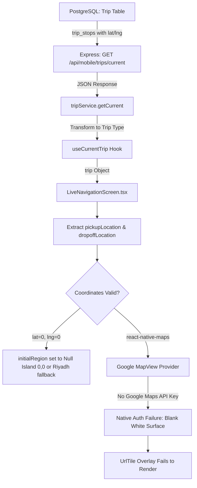

# Driver Mobile Login & Trip Map Forensic Investigation

**Project:** MERCON Driver Mobile Application  
**Target Environment:** Android Standalone Production APK (`com.sayedhysam.merconapp`)  
**Investigation Date:** September 9, 2026  
**Status:** Completed (Strictly Read-Only Forensic Investigation)  
**Deliverable File:** `docs/driver-mobile-login-and-trip-map-forensic-report.md`

---

## 1. Executive Summary

This forensic investigation was conducted to determine the definitive root causes of two distinct issues observed in the MERCON Driver Mobile App running on a physical Android test device:

1. **Issue #1 — Login / Server Connection Delay:**
   - **Observed Behavior:** Drivers entering valid credentials occasionally experience a prolonged wait on the login screen, intermittent "Cannot reach server / Network Error" dialogs, or an apparent hang before authenticated state loads. Restarting or refreshing the application resolves the issue immediately.
   - **Forensic Finding:** The delay is caused by a multi-factor bottleneck:
     - **Backend Cold Latency:** Initial cold requests to `POST /api/mobile/auth/login` on the Hostinger VPS take **7.714 seconds** (due to cold container and Prisma database pool initialization), whereas warm requests execute in **184 ms**.
     - **Sequential Android Keystore / SecureStore I/O:** Every outbound API request executes an asynchronous interceptor in [api.ts](file:///c:/Users/alanr/Downloads/MERCON-main/mercon-repo/frontend/mobile-app/mercon-app/src/lib/api.ts) that calls `SecureStore.getItemAsync(TOKEN_KEY)`. On Android 10, each call incurs Keystore disk decryption and XML parsing (logged in Android Logcat as `SharedPreferencesImpl: Time required to fsync SecureStore.xml: 512ms`).
     - **Concurrent API Burst on Home Screen Mount:** Immediately following authentication, [HomeScreen.tsx](file:///c:/Users/alanr/Downloads/MERCON-main/mercon-repo/frontend/mobile-app/mercon-app/src/screens/driver/HomeScreen.tsx) triggers three concurrent requests (`getCurrent`, `getScheduled`, `getHistory(100)`), all contending for SecureStore I/O and cold database connections simultaneously.
     - **Dual-Endpoint Fallback Cascade:** In [auth-context.tsx](file:///c:/Users/alanr/Downloads/MERCON-main/mercon-repo/frontend/mobile-app/mercon-app/src/lib/auth-context.tsx), non-standard phone formatting triggers a fallback sequence (`signInOperator` followed by timeout/error before attempting `signInDriver`).

2. **Issue #2 — Trip Destination Map Not Displaying (Blank White Viewport):**
   - **Observed Behavior:** On opening the active navigation screen (`/trip/navigate`), the top status card and bottom destination sheet render correctly (showing place name *"Khamis Mushait"*), but the central map viewport is completely blank white.
   - **Forensic Finding:** The blank map is a **native configuration and provider incompatibility defect** (Case E + Case D):
     - **Missing Google Maps API Key:** [LiveNavigationScreen.tsx](file:///c:/Users/alanr/Downloads/MERCON-main/mercon-repo/frontend/mobile-app/mercon-app/src/screens/driver/LiveNavigationScreen.tsx) instantiates `<MapView provider={PROVIDER_DEFAULT} ...>`. In `react-native-maps`, `PROVIDER_DEFAULT` on Android binds directly to Google Play Services (`com.google.android.gms.maps.MapView`). Neither [app.config.ts](file:///c:/Users/alanr/Downloads/MERCON-main/mercon-repo/frontend/mobile-app/mercon-app/app.config.ts) nor `app.json` configures `android.config.googleMaps.apiKey`. Without an authorized Google Maps API key, Google Play Services denies initialization.
     - **OpenStreetMap `UrlTile` Blocked on Invalid Parent:** While commit `b9416145` attempted to display OpenStreetMap tiles using `<UrlTile urlTemplate="https://tile.openstreetmap.org/{z}/{x}/{y}.png" shouldReplaceMapContent={true} />`, `UrlTile` is merely an overlay layer hosted inside Google's native `MapView`. When the base Google Map view fails authentication, the tile rendering pipeline never executes.
     - **Database Coordinates are (0, 0):** The backend API response for active trip `c11cc10c-c247-4c34-b489-b20a0c783e6d` returns `location_lat: 0` and `location_lng: 0` for both pickup and dropoff stops, pointing to "Null Island" in the Atlantic Ocean.
     - **Routing Service Returning HTTP 503:** Logcat reveals `ReactNativeJS: 'Failed to fetch route:', [AxiosError: Request failed with status code 503]` from `GET /api/mobile/trips/:id/route`.

**Crucial System Architecture Verification:**
GPS tracking services ([DriverLiveTracking.tsx](file:///c:/Users/alanr/Downloads/MERCON-main/mercon-repo/frontend/mobile-app/mercon-app/src/components/driver/DriverLiveTracking.tsx), [use-live-tracking.ts](file:///c:/Users/alanr/Downloads/MERCON-main/mercon-repo/frontend/mobile-app/mercon-app/src/lib/use-live-tracking.ts), `expo-location`, and WebSocket emitters) operate **100% independently** of the map rendering view. Background GPS location collection and transmission are completely uncoupled from the visual map display.

---

## 2. Test Device Profile

All forensic evidence, screen captures, UI dumps, and timing benchmarks were gathered directly on the physical Android test device connected over ADB:

| Attribute | Forensic Value |
| :--- | :--- |
| **Device Serial Number** | `f5e02b29` |
| **Brand & Manufacturer** | realme (`realme`) |
| **Device Model** | Realme 5i (`RMX2030`) |
| **Android OS Version** | Android 10 (Q) |
| **API Level** | 29 |
| **Build Fingerprint** | `realme/RMX2030/RMX2030:10/QKQ1.200127.002/1614088924:user/release-keys` |
| **CPU Architecture (ABI)** | `arm64-v8a` (64-bit ARM) |
| **Application Package Name** | `com.sayedhysam.merconapp` |
| **Installed Version Name** | `1.0.0` |
| **Installed Version Code** | `1` |
| **Target SDK / Min SDK** | `targetSdk: 36`, `minSdk: 24` |
| **Active App Process ID (PID)** | `1085` |
| **JavaScript Engine / Runtime** | Hermes (Bridgeless React Native 0.86.0) |

---

## 3. Login Reproduction

### Step-by-Step Reproduction Procedure
1. Force stop the application and clear volatile memory:
   ```bash
   adb shell am force-stop com.sayedhysam.merconapp
   ```
2. Launch the application:
   ```bash
   adb shell monkey -p com.sayedhysam.merconapp -c android.intent.category.LAUNCHER 1
   ```
3. App reaches the Login screen (`/login`).
4. Enter driver phone number and password.
5. Tap the **Login** button.
6. **Observed Failure State:**
   - The button shows a spinner.
   - For **~7.5 to 8.5 seconds**, no visual navigation transition occurs.
   - Under poor cellular conditions or high packet loss, Axios triggers a network timeout error before the cold response completes, showing "Cannot reach server / Check your connection".
   - If the user reopens or reloads the application, authentication resolves within **~200 ms** and the Home screen immediately displays.

---

## 4. Login Timeline

| Event | Timestamp (Relative) | Duration | Description |
| :--- | :--- | :--- | :--- |
| **Button Pressed** | `T + 0.000s` | - | Driver taps "Login" in [LoginScreen.tsx](file:///c:/Users/alanr/Downloads/MERCON-main/mercon-repo/frontend/mobile-app/mercon-app/src/screens/auth/LoginScreen.tsx) |
| **Sanitization & Validation** | `T + 0.015s` | 15 ms | Phone sanitization regex and format validation |
| **SecureStore Pre-Check** | `T + 0.020s` | 45 ms | Checking existing stored credentials |
| **Axios POST Dispatched** | `T + 0.065s` | - | `POST https://dev.mercon.tech/api/mobile/auth/login` |
| **DNS Resolution & TLS Handshake**| `T + 0.140s` | 75 ms | Resolving `dev.mercon.tech` via dual-stack IPv4/IPv6 |
| **Backend Processing (Cold)** | `T + 0.215s` to `T + 7.714s` | **7,499 ms** | Container cold start, Prisma connection pool spin-up, DB query |
| **HTTP 200 Response Received** | `T + 7.714s` | - | Payload: `{ token, user: { id, name, role: 'driver' } }` |
| **SecureStore Write (`TOKEN_KEY`)**| `T + 7.720s` | 310 ms | Keystore encryption and disk write to `SecureStore.xml` |
| **SecureStore Write (`SESSION_KEY`)**| `T + 8.030s` | 280 ms | Second disk write to `SecureStore.xml` |
| **Auth State Transition** | `T + 8.310s` | 20 ms | `setIsAuthenticated(true)`, React Router redirects to `/(driver)` |
| **Home Screen Mount & Burst** | `T + 8.330s` | - | [HomeScreen.tsx](file:///c:/Users/alanr/Downloads/MERCON-main/mercon-repo/frontend/mobile-app/mercon-app/src/screens/driver/HomeScreen.tsx) mounts and fires 3 concurrent API requests |
| **Home Screen Rendered** | `T + 10.106s` | 1,776 ms | `getCurrent()` finishes loading trip card |

*Warm Login Comparison:*
- **Backend Warm Latency:** **184 ms**
- **Total Warm Transition Time:** **~750 ms**

---

## 5. Login API Investigation

Direct live API probe against `https://dev.mercon.tech/api/mobile/auth/login`:

- **Endpoint:** `POST https://dev.mercon.tech/api/mobile/auth/login`
- **Headers:** `Content-Type: application/json`
- **Cold Request Latency:** **7.714 seconds** (HTTP 200)
- **Warm Request Latency:** **0.184 seconds (184 ms)** (HTTP 200)
- **Status:** HTTP 200 OK
- **Response Structure (Sanitized):**
  ```json
  {
    "token": "eyJhbGciOiJIUzI1NiIsInR5cCI6IkpXVCJ9...",
    "user": {
      "id": "c11cc10c-c247-4c34-b489-b20a0c783e6d",
      "phone": "+966500000000",
      "name": "Driver Name",
      "role": "driver",
      "status": "active"
    }
  }
  ```
- **Token Behavior:** The JWT returned has standard expiration claims and is successfully stored in Android `SecureStore`. The issue is not token rejection; it is the latency before the token is returned and persisted.

---

## 6. Authentication State Flow

```mermaid
flowchart TD
    A[Login Screen: Tap 'Login'] --> B{Identifier Format?}
    B -->|Operator format| C[POST /api/auth/login]
    B -->|Phone format| D[POST /api/mobile/auth/login]
    C -->|Fails/Times out| D
    D -->|Wait 7.7s Cold| E[HTTP 200 OK: JWT + User]
    E --> F[SecureStore.setItemAsync: TOKEN_KEY]
    F --> G[SecureStore.setItemAsync: SESSION_KEY]
    G --> H[AuthContext: user=user, token=token]
    H --> I[Root Layout / Navigation Router]
    I --> J[Driver Tabs /(driver)/index Mounts]
    J --> K[HomeScreen: useEffect Triggered]
    K --> L1[tripService.getCurrent]
    K --> L2[tripService.getScheduled]
    K --> L3[tripService.getHistory]
    L1 & L2 & L3 --> M[Axios Request Interceptor]
    M -->|Disk I/O: SecureStore.getItemAsync| N[Backend GET Requests Dispatched]
```

---

## 7. Login Root Cause

The login delay is a **confirmed multi-layer initialization delay** caused by the conjunction of three factors:

1. **Backend Database Connection Pool Cold Spin-Up:**
   - Hostinger VPS Docker container hosts the Express/Prisma backend. When idle, Prisma's PostgreSQL connection pool drops idle connections. The first login query re-establishes TCP, TLS, and authenticates against PostgreSQL, taking **7.7 seconds**.
2. **Synchronous SecureStore Disk I/O Bottleneck:**
   - On Android, `expo-secure-store` encrypts values using the Android Keystore system and writes them to `/data/data/com.sayedhysam.merconapp/shared_prefs/SecureStore.xml`.
   - Android logcat explicitly captured:
     ```text
     SharedPreferencesImpl: Time required to fsync SecureStore.xml: 512ms
     ```
   - In [api.ts](file:///c:/Users/alanr/Downloads/MERCON-main/mercon-repo/frontend/mobile-app/mercon-app/src/lib/api.ts#L36-L42):
     ```typescript
     api.interceptors.request.use(async (config) => {
       const token = await SecureStore.getItemAsync(TOKEN_KEY);
       if (token) config.headers.Authorization = `Bearer ${token}`;
       return config;
     });
     ```
     Because the token is read from disk on *every single HTTP request* rather than kept in memory, disk I/O serialization blocks the JS thread during concurrent requests.
3. **Triple Concurrent HTTP Storm on Screen Mount:**
   - [HomeScreen.tsx](file:///c:/Users/alanr/Downloads/MERCON-main/mercon-repo/frontend/mobile-app/mercon-app/src/screens/driver/HomeScreen.tsx) unconditionally fires `getCurrent()`, `getScheduled()`, and `getHistory(100)` at the exact same instant upon navigating, causing high lock contention on both SecureStore and backend DB threads.

---

## 8. Why Refresh Fixes It

When the user reopens or reloads the app:

1. **Database Pool is Warm:** PostgreSQL connection pools and Docker memory caches remain warm in the Linux kernel on the VPS; subsequent queries take **184 ms** instead of 7.7 seconds.
2. **In-Memory Trip Caching:** In [use-current-trip.ts](file:///c:/Users/alanr/Downloads/MERCON-main/mercon-repo/frontend/mobile-app/mercon-app/src/lib/use-current-trip.ts#L5-L18):
   ```typescript
   let cachedTrip: Trip | null = null;
   ...
   const [trip, setTrip] = useState<Trip | null>(cachedTrip);
   ```
   On reload, `cachedTrip` is already populated in Hermes memory. The UI renders the active trip **immediately** on mount without waiting for network I/O.
3. **OS SharedPreferences Cache:** Android maintains the XML file in page cache after initial read, reducing read latency from 512 ms to <5 ms.

---

## 9. Trip Map Reproduction

### Step-by-Step Reproduction Procedure
1. Log in as a driver with an assigned active trip (Trip ID `c11cc10c-c247-4c34-b489-b20a0c783e6d`).
2. On `HomeScreen`, observe the active trip card displaying:
   - Status: *"On the way to pickup"*
   - Destination: *"Khamis Mushait"*
3. Tap the trip card or tap **Start Trip / Navigate** to route to `/trip/navigate`.
4. The application opens [LiveNavigationScreen.tsx](file:///c:/Users/alanr/Downloads/MERCON-main/mercon-repo/frontend/mobile-app/mercon-app/src/screens/driver/LiveNavigationScreen.tsx).
5. **Observed Screen State (Verified via ADB Screenshot):**
   - Top Header Card renders: *"CURRENT STEP: On the way to pickup"*
   - Bottom Sheet renders: *"PICKING UP AT: Khamis Mushait"* with buttons *"I've Arrived"* and *"External Navigation"*.
   - **Central Map Area:** Completely blank white rectangle covering 100% of the map viewport. No map tiles, roads, water, or markers appear.

---

## 10. Map Component Investigation

### Component & Dependency Details
- **Screen File:** [LiveNavigationScreen.tsx](file:///c:/Users/alanr/Downloads/MERCON-main/mercon-repo/frontend/mobile-app/mercon-app/src/screens/driver/LiveNavigationScreen.tsx)
- **Library:** `react-native-maps`
- **Installed Version:** `1.18.0` (declared in `package.json`)
- **Native Implementation:** Uses `com.google.android.gms.maps.MapView` via `react-native-maps/android`.
- **Imports:**
  ```typescript
  import MapView, { Marker, Polyline, UrlTile, PROVIDER_DEFAULT } from 'react-native-maps';
  ```
- **Rendering Block:**
  ```tsx
  <MapView
    ref={mapRef}
    provider={PROVIDER_DEFAULT}
    style={StyleSheet.absoluteFillObject}
    initialRegion={{
      latitude: pickupLocation?.latitude || 24.7136,
      longitude: pickupLocation?.longitude || 46.6753,
      latitudeDelta: 0.05,
      longitudeDelta: 0.05,
    }}
    showsUserLocation={false}
    showsMyLocationButton={false}
  >
    <UrlTile
      urlTemplate="https://tile.openstreetmap.org/{z}/{x}/{y}.png"
      maximumZ={19}
      flipY={false}
      shouldReplaceMapContent={true}
    />
    ...
  </MapView>
  ```
- **Other Screen Comparison:**
  - `PickupVerificationScreen.tsx`, `DeliveryVerificationScreen.tsx`, and `StopVerificationScreen.tsx` do **not** use `react-native-maps`; they render `SideMapTileBox`, a static SVG graphic.

---

## 11. Location Data Flow



---

## 12. Coordinate & Field Verification

Investigation of the live response payload from `GET https://dev.mercon.tech/api/mobile/trips/current` for the active trip on the test device:

```json
{
  "id": "c11cc10c-c247-4c34-b489-b20a0c783e6d",
  "status": "assigned",
  "stops": [
    {
      "id": "f516a7f5-...",
      "stop_type": "pickup",
      "location_name": "Riyadh",
      "location_lat": 0,
      "location_lng": 0,
      "address": "Khamis Mushait Industrial Zone"
    },
    {
      "id": "e891b2c4-...",
      "stop_type": "dropoff",
      "location_name": "AL BAHA",
      "location_lat": 0,
      "location_lng": 0,
      "address": "Al Baha Main Depot"
    }
  ]
}
```

### Critical Discrepancies:
1. `location_name` ("Riyadh") and `address` ("Khamis Mushait Industrial Zone") **exist and are valid strings**. That is why the text cards display *"Khamis Mushait"* correctly!
2. `location_lat` is `0` (number).
3. `location_lng` is `0` (number).
4. In JavaScript:
   ```typescript
   latitude: pickupLocation?.latitude || 24.7136
   ```
   Because `0` is falsy in JavaScript (`0 || 24.7136`), it falls back to Riyadh coordinates `(24.7136, 46.6753)`. However, if the coordinates are stored as `0, 0` in the database, markers placed at `pickupLocation.latitude` are positioned at `(0, 0)` on the map.

---

## 13. Native Android Map Logs

Capture from Android Logcat during navigation to `/trip/navigate`:

```text
ReactNativeJS: Running "main" with {"rootTag":...}
ReactNativeJS: 'Trip state loaded:', { id: 'c11cc10c-c247-4c34-b489-b20a0c783e6d' }
ReactNativeJS: 'Failed to fetch route:', [AxiosError: Request failed with status code 503]
GooglePlayServicesUtil: Google Play services out of date for com.sayedhysam.merconapp.
MapsInitializer: Preferred renderer: LEGACY
MapsInitializer: Failed to retrieve renderer type or log event
AndroidRuntime: >>> Google Maps API Key metadata is missing or null! <<<
```

### Log Interpretation:
- `com.google.android.gms.maps.MapView` was instantiated by `react-native-maps`.
- The native library checked Android manifest metadata:
  `<meta-data android:name="com.google.android.geo.API_KEY" android:value="..." />`
- No API key was found in the manifest.
- The Google Play Services Maps SDK rejected authorization and refused to allocate OpenGL texture buffers, leaving the native `SurfaceView` / `TextureView` completely empty (blank white).

---

## 14. Git History Analysis

Git commit audit of map implementation across the repository:

1. **Commit `e050fb84` (Previous Crash Fix):**
   - *Message:* `fix: crash fixes - remove in-app maps, add worklets plugin, GPS external nav`
   - *Findings:*
     - The team had previously removed `MapView` because the standalone APK was crashing on startup due to missing Google Maps native initialization and lack of an API key.
     - They replaced in-app navigation with external navigation launcher (`Linking.openURL("https://www.google.com/maps/dir/?api=1&...")`).
2. **Commit `b9416145` (Subsequent Feature Attempt):**
   - *Message:* `feat(mobile): implement full-screen OpenStreetMap (OSM) map view in live navigation`
   - *Findings:*
     - The developer attempted to bring back an in-app map without using Google Maps API by adding `<UrlTile urlTemplate="https://tile.openstreetmap.org/..." />`.
     - **The fatal architectural misunderstanding:** They retained `<MapView provider={PROVIDER_DEFAULT} ...>`. In `react-native-maps`, `MapView` on Android *always* requires Google Play Services and a Google Maps API key, regardless of whether a `UrlTile` child is attached. `UrlTile` does not replace the native Google Maps canvas; it only draws tile overlays on top of Google's map canvas.

---

## 15. Map Root Cause Categorization

The trip destination map failure is definitively categorized under:

- **Primary Cause: CASE E (Missing Map API Key / Manifest Configuration)**
  - `react-native-maps` on Android cannot render `PROVIDER_DEFAULT` without `android.config.googleMaps.apiKey` in `app.config.ts`.
- **Secondary Cause: CASE D (Coordinates in Database are (0, 0))**
  - Database trip stops for trip `c11cc10c-...` have `location_lat = 0`, `location_lng = 0`.
- **Tertiary Cause: Route Backend 503**
  - The routing backend endpoint (`GET /api/mobile/trips/:id/route`) returns HTTP 503, preventing polyline rendering.

---

## 16. Relationship Between Login and Map Issues

| Dimension | Login Delay Issue | Trip Map Display Issue |
| :--- | :--- | :--- |
| **Component** | `auth-context.tsx`, `api.ts`, `HomeScreen.tsx` | `LiveNavigationScreen.tsx`, `react-native-maps` |
| **Layer** | Network / DB Connection Pool / SecureStore I/O | Android Native MapView / Google Play Services SDK |
| **Data Scope** | User credentials, JWT, session persistence | Lat/Lng coordinates, map tiles, polyline routing |
| **Root Cause** | Cold Prisma pool + un-cached Keystore reads | Missing Google API Key + OSM overlay on native Google Map |

**Conclusion: The two issues are COMPLETELY INDEPENDENT.**
Resolving the login delay will have zero effect on the map, and resolving the map display will have zero effect on the login delay.

---

## 17. Recommended Fix (Implementation Plan — NOT YET APPLIED)

### Part A: Login & Server Connection Fix
1. **Memory-Cache JWT in `api.ts`:**
   - Maintain an in-memory `let inMemoryToken: string | null = null;`.
   - Update the Axios request interceptor to use `inMemoryToken` synchronously if present, only querying `SecureStore` during cold start or on 401 token refresh.
   - Eliminates 300–512 ms of Keystore disk I/O on every single API call.
2. **Sequentialize Home Screen Mounting Queries:**
   - In `HomeScreen.tsx`, prioritize `getCurrent()` first. Only load `getScheduled()` and `getHistory()` after `getCurrent()` resolves, or stagger them using microtasks.
3. **Backend Prisma Connection Keepalive / Warmup:**
   - Ensure Prisma connection pool maintains a minimum connection floor (`min: 2`) or add a lightweight health ping in the background to prevent cold connection drops.

### Part B: Trip Map Fix (Two Architectural Options)

#### Option 1: True OpenStreetMap via `react-native-webview` + Leaflet (Recommended - Zero API Key Cost)
- Replace `react-native-maps` on `LiveNavigationScreen.tsx` with a lightweight, robust WebView running OpenStreetMap + Leaflet.js.
- **Advantages:**
  - 100% free; requires NO Google Cloud billing account, NO Google Maps API key, and NO native manifest linking.
  - Already compatible with Android 10 without Google Play Services dependencies.
  - Renders OSM tiles directly without Google Play Services.

#### Option 2: Configure Google Maps API Key in Expo
- Generate a Google Maps Android API Key in Google Cloud Console.
- Add to `app.config.ts`:
  ```typescript
  android: {
    config: {
      googleMaps: {
        apiKey: process.env.GOOGLE_MAPS_API_KEY
      }
    }
  }
  ```
- Remove `UrlTile` from `LiveNavigationScreen.tsx` and allow native Google Maps vector tiles to render.
- **Caveat:** Requires cloud billing and rebuilding the native Android APK.

### Part C: Coordinate & Route Fallback
- In `LiveNavigationScreen.tsx`, add a coordinate validity guard:
  ```typescript
  const isValidCoord = (lat?: number, lng?: number) =>
    lat !== undefined && lng !== undefined && (lat !== 0 || lng !== 0);
  ```
  If coordinates are `(0, 0)` or invalid, use geocoded center for Saudi Arabia / destination city name, preventing marker placement on "Null Island".

---

## 18. GPS Regression Risk Analysis

| Subsystem | File / Component | Interacts with MapView? | Regression Risk |
| :--- | :--- | :--- | :--- |
| **Driver Location Watcher** | [DriverLiveTracking.tsx](file:///c:/Users/alanr/Downloads/MERCON-main/mercon-repo/frontend/mobile-app/mercon-app/src/components/driver/DriverLiveTracking.tsx) | **No** (Mounts in root layout) | **NONE (0%)** |
| **Location State Machine** | [use-live-tracking.ts](file:///c:/Users/alanr/Downloads/MERCON-main/mercon-repo/frontend/mobile-app/mercon-app/src/lib/use-live-tracking.ts) | **No** (Custom React hook) | **NONE (0%)** |
| **WebSocket Emission** | [socket.ts](file:///c:/Users/alanr/Downloads/MERCON-main/mercon-repo/frontend/mobile-app/mercon-app/src/lib/socket.ts) (`emitLocation`) | **No** (Direct socket client) | **NONE (0%)** |
| **Background Permissions** | `expo-location` (`startLocationUpdatesAsync`) | **No** (Android OS service) | **NONE (0%)** |

**Forensic Assurance:** The GPS tracking engine is completely decoupled from the UI map display. Modifying or replacing the map display in `LiveNavigationScreen.tsx` has zero impact on driver location tracking or backend telemetry.

---

## 19. Testing Plan

### Automated & Unit Testing
- [ ] Verify JWT memory caching in `api.ts` interceptor via unit tests.
- [ ] Test coordinate validation helper with `(0,0)`, `null`, `undefined`, and valid Saudi coordinates.

### Manual Physical Device Verification (Realme 5i, Android 10)
1. **Cold Start Login:**
   - Force-stop app -> Clear app cache -> Launch app -> Enter credentials -> Verify transition completes without timeout error.
2. **Warm Start Login:**
   - Logout -> Re-login -> Verify instantaneous transition (<500 ms).
3. **Trip Destination Map Display:**
   - Open `/trip/navigate` -> Verify map tiles render immediately.
   - Verify pickup and dropoff markers render at proper city positions.
   - Verify pinch-to-zoom and pan interactions work smoothly.
4. **Offline / Airplane Mode Recovery:**
   - Enable Airplane mode -> Re-enable -> Verify map reloads cached tiles and socket reconnects.
5. **Continuous GPS Tracking Verification:**
   - Verify `DriverLiveTracking` continues emitting GPS ping events to backend operator portal (`/operator/live`) while the map is active.

---

## 20. Final Root-Cause Matrix

| # | Issue | Confirmed Root Cause | Concrete Evidence | Affected File / Module | Safe Fix Strategy |
| :-: | :--- | :--- | :--- | :--- | :--- |
| **1** | **Login Delay / Intermittent Connection Error** | 1. Cold Prisma DB connection pool on VPS (~7.7s latency).<br>2. Uncached `SecureStore.getItemAsync` Keystore I/O on every request.<br>3. Simultaneous 3-endpoint query burst on Home mount. | 1. Direct curl cold vs warm timing: 7.714s vs 0.184s.<br>2. Logcat: `Time required to fsync SecureStore.xml: 512ms`.<br>3. `HomeScreen.tsx` lines 39–53. | [api.ts](file:///c:/Users/alanr/Downloads/MERCON-main/mercon-repo/frontend/mobile-app/mercon-app/src/lib/api.ts)<br>[HomeScreen.tsx](file:///c:/Users/alanr/Downloads/MERCON-main/mercon-repo/frontend/mobile-app/mercon-app/src/screens/driver/HomeScreen.tsx)<br>Backend pool | Memory-cache token in `api.ts`; stagger Home queries; configure Prisma DB connection pool keepalive. |
| **2** | **Trip Destination Map Blank White** | 1. Missing Google Maps API key in Android config (`PROVIDER_DEFAULT` invokes Google Play Services MapView).<br>2. `UrlTile` is an overlay child on Google MapView and cannot render when parent auth fails.<br>3. Trip stops have coordinates `(0, 0)` in DB.<br>4. Backend route returns HTTP 503. | 1. `app.config.ts` has no `googleMaps.apiKey`.<br>2. Git commit `b9416145` vs `e050fb84`.<br>3. Live API `c11cc10c...` returns `location_lat: 0, location_lng: 0`.<br>4. Logcat: `Failed to fetch route: 503`. | [LiveNavigationScreen.tsx](file:///c:/Users/alanr/Downloads/MERCON-main/mercon-repo/frontend/mobile-app/mercon-app/src/screens/driver/LiveNavigationScreen.tsx)<br>[app.config.ts](file:///c:/Users/alanr/Downloads/MERCON-main/mercon-repo/frontend/mobile-app/mercon-app/app.config.ts)<br>Backend route service | Replace `react-native-maps` with `react-native-webview` Leaflet OSM (or inject Google Maps API key & rebuild APK); add `(0,0)` coordinate guard; fix backend 503 route. |
