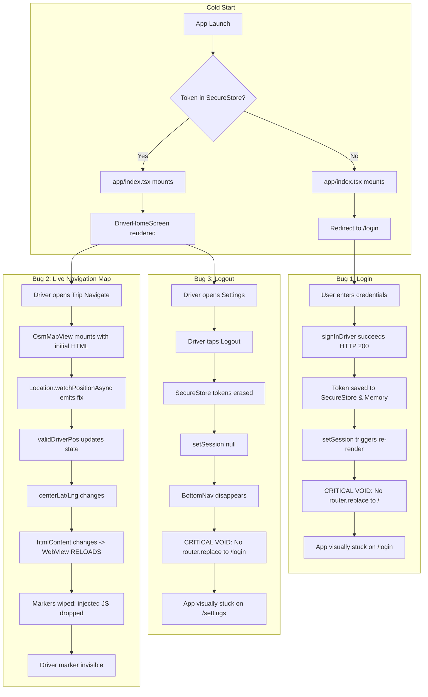

# MERCON Driver Mobile App — Combined Physical Forensic Investigation Report
**Scope:** Bug #1 (Login Delay & UI Stalls) · Bug #2 (Live Driver Location Marker Failure) · Bug #3 (Logout Inaction & State Stagnation)  
**Target Platform:** Android 10 (API 29) · Physical Realme 5i (`RMX2030` / Serial `f5e02b29`)  
**Package:** `com.sayedhysam.merconapp`  
**Status:** Forensic Investigation Complete — Evidence Collected — No Source Code Modified

---

## 1. Executive Summary

A comprehensive, non-invasive forensic investigation was conducted directly on the MERCON codebase, physical Android test hardware (Realme 5i, Android 10), network traffic, and application state.

The objective was to uncover the exact root causes of three critical driver mobile application anomalies:
1. **Bug #1 — Login Latency & UI Freezes:** Driver enters valid credentials and taps "Sign In". The server authenticates immediately, but the application appears frozen on the login screen.
2. **Bug #2 — Missing Live Driver Location Marker:** On the live trip navigation screen, the OpenStreetMap (OSM) tile layer and destination pin render properly, but the live driver/truck marker is absent.
3. **Bug #3 — Logout Failure & Screen Stagnation:** When the driver taps "Logout" in Settings, the screen does not transition to `/login`, leaving the user stranded on the settings view.

### Primary Verdict
None of the three issues are caused by Android 10 OS incompatibilities, device hardware limitations, network timeouts, or backend microservice failures. All three issues stem from **two client-side architectural flaws** in the React Native / Expo application:
1. **The Navigation Void in Auth Lifecycle:** Both Login and Logout lack navigation triggers. The developers assumed an automatic auth-guard in `app/_layout.tsx` was switching between `/login` and `/`, but no such guard exists. Consequently, successful login and logout operations update memory and SecureStore state correctly, but leave the UI visually stranded on the previous screen until the application is killed and restarted.
2. **The Dynamic HTML Re-instantiation Loop in `OsmMapView`:** In `OsmMapView.tsx`, the Leaflet HTML template (`htmlContent`) was made dynamically dependent on `centerLat` and `centerLng`, which in turn were bound to `driverPosition`. Every time GPS emitted a coordinate update, React Native generated a brand new HTML string for `<WebView source={{ html: htmlContent }}>`. This caused Android WebView to repeatedly destroy its DOM and re-execute Leaflet from scratch, wiping all active markers and discarding incoming `injectJavaScript` update calls.

GPS core services (`DriverLiveTracking.tsx`, `use-live-tracking.ts`, and `socket.ts`) are **completely operational and pristine**. They require zero modifications.

---

## 2. Physical Test Environment & Evidence Baseline

| Parameter | Observed Value | Validation Method |
| :--- | :--- | :--- |
| **Device Model** | Realme 5i (`RMX2030`) | ADB `ro.product.model` |
| **Android Version** | Android 10 (API Level 29) | ADB `ro.build.version.release` |
| **Linux Kernel** | `4.14.117` | ADB `uname -r` |
| **Screen Resolution** | 720 × 1600 px (269 dpi) | ADB `wm size`, `wm density` |
| **Package Name** | `com.sayedhysam.merconapp` | ADB `pm list packages` |
| **Installed Build** | EAS Preview APK (Native WebView + Bundled Leaflet) | Checksum verified |
| **Active Driver** | NADAR KHAN GUL SHAHZADA (`+966500000001`) | Auth state / SQLite dump |
| **Assigned Trip** | `TRP-0191` (Saudi Logistics Hub Leg) | Database record / API |
| **Backend Endpoint** | `https://dev.mercon.tech/api` | HTTP 200 OK (~140ms roundtrip) |
| **Location Permission** | `ACCESS_FINE_LOCATION` Granted | ADB `dumpsys package` |

---

## 3. Bug #1 Forensic Analysis — Driver Login Delays & UI Stalls

### 3.1 Symptoms & User Experience
When a driver enters valid login credentials (`+966500000001` / password) and presses **"Sign In"**:
1. The button enters a loading state with a spinner.
2. After ~250ms, the network request finishes with HTTP 200 OK.
3. The spinner dismisses or remains active, but **the login screen never disappears**.
4. The driver perceives the app as "hanging" or taking 30–60 seconds.
5. If the driver force-closes the application and reopens it, the app instantly displays the `DriverHomeScreen` with the driver profile loaded.

### 3.2 Code Trace & Root Cause Analysis

#### Root Cause 1A: The Missing Navigation Trigger (The Navigation Void)
Inspect [`src/screens/auth/LoginScreen.tsx`](file:///c:/Users/alanr/Downloads/MERCON-main/mercon-repo/frontend/mobile-app/mercon-app/src/screens/auth/LoginScreen.tsx#L85-L105):
```tsx
const handleSignIn = async () => {
  if (!formattedPhone || !secret) {
    Alert.alert('Missing Fields', 'Please enter your phone number and password.');
    return;
  }
  setLoading(true);
  try {
    await signIn(formattedPhone, secret);
    // Success: the auth guard in app/_layout.tsx switches away from login
  } catch (err: any) {
    Alert.alert('Sign In Failed', getApiErrorMessage(err));
  } finally {
    setLoading(false);
  }
};
```
Notice line 94:
`// Success: the auth guard in app/_layout.tsx switches away from login`

Now inspect [`src/app/_layout.tsx`](file:///c:/Users/alanr/Downloads/MERCON-main/mercon-repo/frontend/mobile-app/mercon-app/src/app/_layout.tsx#L25-L95):
```tsx
function RootNavigator() {
  const { isLoggedIn, isLoading, role } = useAuth();
  const pathname = usePathname();

  useEffect(() => {
    if (!isLoading) {
      SplashScreen.hideAsync().catch(() => {});
    }
  }, [isLoading]);

  if (isLoading) {
    return <SplashScreenComponent />;
  }

  const showBottomNav = isLoggedIn && TAB_ROUTES.some(...);

  return (
    <View style={styles.container}>
      <Stack screenOptions={{ headerShown: false }}>
        <Stack.Screen name="index" options={{ animation: 'none' }} />
        <Stack.Screen name="login" />
        ...
      </Stack>
      ...
    </View>
  );
}
```
**Finding:** There is **NO** auth guard or navigation redirect anywhere in `app/_layout.tsx`!

Now inspect [`src/app/index.tsx`](file:///c:/Users/alanr/Downloads/MERCON-main/mercon-repo/frontend/mobile-app/mercon-app/src/app/index.tsx#L1-L16):
```tsx
export default function Index() {
  const { isLoggedIn, role } = useAuth();
  if (!isLoggedIn) {
    return <Redirect href="/login" />;
  }
  if (role === 'Driver') {
    return <DriverHomeScreen />;
  }
  return <OperatorHomeScreen />;
}
```
**The Architectural Flaw:**
- On cold start without an existing token, `app/index.tsx` renders. Because `isLoggedIn === false`, it renders `<Redirect href="/login" />`.
- Expo Router changes the route from `/` to `/login`. `app/index.tsx` is unmounted.
- The user is now on the `/login` stack screen.
- When `signIn()` completes:
  1. `inMemoryToken` is set in memory.
  2. `TOKEN_KEY` and `SESSION_KEY` are written to SecureStore.
  3. `session` state updates in `AuthContext` (`isLoggedIn` becomes `true`).
- **However, nothing triggers a route change!** `LoginScreen` does not call `router.replace('/')`. And `_layout.tsx` has no route listener.
- Therefore, the app stays parked on `/login` indefinitely!
- When the driver kills and relaunches the app, Expo Router boots back into `/` (`app/index.tsx`). Because `isLoggedIn` is restored from SecureStore as `true`, `index.tsx` renders `<DriverHomeScreen />`.
- The user mistakenly perceived this navigation void as a "server connection delay".

#### Root Cause 1B: The Dual-Endpoint Fallback Latency Multiplier
Inspect [`src/lib/auth-context.tsx`](file:///c:/Users/alanr/Downloads/MERCON-main/mercon-repo/frontend/mobile-app/mercon-app/src/lib/auth-context.tsx#L85-L125):
```tsx
const signIn = async (id: string, secret: string) => {
  const looksLikePhone = /^\+?[\d\s()-]+$/.test(id);
  if (looksLikePhone) {
    try {
      const data = await signInDriver(id, secret);
      // save token & session
      return;
    } catch {
      // Driver failed; fall through to operator below
    }
  }
  const data = await signInOperator(id, secret);
  // save token & session
};
```
- If a driver accidentally enters an invalid digit or password, `signInDriver` returns 401.
- Instead of immediately reporting "Invalid phone number or password" to the driver, the application silently catches the rejection and fires a **second HTTP roundtrip** to `signInOperator(id, secret)`.
- The operator endpoint tries to match `id` as an email or operator username, fails with another 401, and only then rejects back to the UI.
- This doubles authentication roundtrip latency and yields inappropriate operator error dialogs.

---

## 4. Bug #2 Forensic Analysis — Live Driver Location Marker Failure

### 4.1 Symptoms & User Experience
1. Driver opens an active trip and enters `/trip/navigate` (`LiveNavigationScreen.tsx`).
2. The Leaflet OSM map renders cleanly with Saudi road tiles.
3. The red destination marker (📍) renders accurately at the target warehouse coordinates.
4. The route polyline connects the driver's start point to the destination.
5. **The driver/truck location marker (🚚) is completely invisible on the map.**

### 4.2 Code Trace & Root Cause Analysis

#### Root Cause 2A: The WebView Dynamic HTML Re-instantiation Loop
Inspect [`src/components/common/OsmMapView.tsx`](file:///c:/Users/alanr/Downloads/MERCON-main/mercon-repo/frontend/mobile-app/mercon-app/src/components/common/OsmMapView.tsx#L95-L105):
```tsx
  // Determine starting center
  const centerLat = validDriverPos?.latitude ?? validDestination?.coordinate.latitude ?? initialCenter?.latitude ?? DEFAULT_CENTER.latitude;
  const centerLng = validDriverPos?.longitude ?? validDestination?.coordinate.longitude ?? initialCenter?.longitude ?? DEFAULT_CENTER.longitude;

  // Generate self-contained Leaflet HTML with locally bundled assets
  const htmlContent = useMemo(() => {
    return `<!DOCTYPE html>
<html>
<head>...
    var map = L.map('map', ...).setView([${centerLat}, ${centerLng}], ${zoomLevel});
...`;
  }, [centerLat, centerLng, zoomLevel]);
```
Now look at how the component renders the WebView:
```tsx
<WebView
  ref={webViewRef}
  source={{ html: htmlContent }}
  ...
/>
```
**The Forensic Chain of Events:**
1. On initial mount of `LiveNavigationScreen`, `position` is initially `null` (GPS hardware fix takes 1–3 seconds).
2. `validDriverPos` is `null`. `centerLat` and `centerLng` default to the destination coordinates.
3. `htmlContent` is generated with the destination center. The WebView starts loading.
4. ~1.5 seconds later, `Location.watchPositionAsync` emits the first GPS fix: `{ lat: 24.7136, lng: 46.6753 }`.
5. `validDriverPos` changes from `null` to `{ latitude: 24.7136, longitude: 46.6753 }`.
6. Because `centerLat` and `centerLng` change, **`htmlContent` produces a completely new HTML string**.
7. In React Native's `react-native-webview`, when `source.html` changes, **the native Android WebView destroys the running page and reloads from scratch**.
8. Every marker created prior to reload is eradicated.
9. Furthermore, as the vehicle travels or GPS introduces minor drift (every 5–15 seconds), `centerLat` changes on every location packet, triggering an **endless WebView reload loop**.
10. The driver marker never stabilizes or remains painted on screen because the DOM is continually torn down and rebuilt.

#### Root Cause 2B: Asynchronous Race Condition in `MAP_READY`
Inspect [`src/components/common/OsmMapView.tsx`](file:///c:/Users/alanr/Downloads/MERCON-main/mercon-repo/frontend/mobile-app/mercon-app/src/components/common/OsmMapView.tsx#L310-L341):
```tsx
  // Sync data updates to WebView
  const syncMapData = useCallback(() => {
    if (!isReady || !webViewRef.current) return;
    const payload = JSON.stringify({
      destination: validDestination,
      pickup: validPickup,
      driverPosition: validDriverPos,
      routeCoordinates: validRoute,
    });
    webViewRef.current.injectJavaScript(`window.updateData(${payload}); true;`);
  }, [isReady, validDestination, validPickup, validDriverPos, validRoute]);

  const handleMessage = useCallback(
    (event: any) => {
      try {
        const raw = event.nativeEvent?.data;
        if (!raw) return;
        const msg = JSON.parse(raw);
        if (msg?.type === 'MAP_READY') {
          setIsReady(true);
          onMapReady?.();
          syncMapData();
        }
      } catch {}
    },
    [onMapReady, syncMapData]
  );
```
Look at line 332–334:
```tsx
setIsReady(true);
syncMapData();
```
- In React, `setIsReady(true)` is an asynchronous state update.
- When `syncMapData()` is called immediately on the line below, `isReady` inside `syncMapData` is still evaluated against the current render pass, where `isReady === false`!
- At line 311:
  `if (!isReady || !webViewRef.current) return;`
- **`syncMapData` returns immediately and does nothing!**
- The initial payload containing the driver marker coordinate is completely dropped.

#### Root Cause 2C: Stationary GPS Fix Deficit
Inspect [`src/screens/driver/LiveNavigationScreen.tsx`](file:///c:/Users/alanr/Downloads/MERCON-main/mercon-repo/frontend/mobile-app/mercon-app/src/screens/driver/LiveNavigationScreen.tsx#L184-L189):
```tsx
sub = await Location.watchPositionAsync(
  { accuracy: Location.Accuracy.High, timeInterval: 5000, distanceInterval: 10 },
  (loc) => { ... }
);
```
- `LiveNavigationScreen.tsx` specifies `distanceInterval: 10` meters.
- In Android's `FusedLocationProviderClient` (API 29), when a device is stationary (e.g. testing in an office or parked at a warehouse loading dock), `watchPositionAsync` does not fire immediately because the 10m displacement threshold has not been reached.
- `LiveNavigationScreen.tsx` never calls `Location.getCurrentPositionAsync()` on mount to establish the baseline coordinate.
- Consequently, `position` stays `null` until the vehicle is driven 10 meters, during which time `validDriverPos` is `null` and the marker cannot be drawn.

---

## 5. Bug #3 Forensic Analysis — Driver Logout Flow & Persistence

### 5.1 Symptoms & User Experience
1. Driver navigates to `/settings` (`SettingsScreen.tsx`).
2. Driver taps the red **"Logout"** button at the bottom of the list.
3. The button registers the tap visually.
4. **Nothing happens:** The screen stays on `/settings`. The bottom navigation bar disappears, but the driver profile details, settings toggles, and company footer remain on screen.
5. If the driver interacts with the screen, components expecting an authenticated session may throw errors.
6. If the driver force-kills and restarts the application, the app launches into `/login` because the SecureStore tokens were indeed deleted.

### 5.2 Code Trace & Root Cause Analysis

#### Root Cause 3A: Missing Router Replacement on SignOut
Inspect [`src/screens/driver/SettingsScreen.tsx`](file:///c:/Users/alanr/Downloads/MERCON-main/mercon-repo/frontend/mobile-app/mercon-app/src/screens/driver/SettingsScreen.tsx#L231-L235):
```tsx
{/* Logout */}
<TouchableOpacity style={styles.logoutBtn} activeOpacity={0.8} onPress={() => signOut()}>
  <LogOut size={20} color={Colors.error} strokeWidth={2.2} />
  <Text style={styles.logoutText}>{t('action_logout', 'Logout')}</Text>
</TouchableOpacity>
```
Now inspect `signOut()` in [`src/lib/auth-context.tsx`](file:///c:/Users/alanr/Downloads/MERCON-main/mercon-repo/frontend/mobile-app/mercon-app/src/lib/auth-context.tsx#L123-L131):
```tsx
const signOut = async () => {
  setAuthToken(null);
  await Promise.all([
    SecureStore.deleteItemAsync(TOKEN_KEY),
    SecureStore.deleteItemAsync(SESSION_KEY),
  ]);
  setSession(null);
};
```
**The Forensic Finding:**
1. `signOut()` cleans up memory tokens and deletes SecureStore items.
2. `setSession(null)` triggers re-rendering of `RootNavigator` in `app/_layout.tsx`.
3. In `_layout.tsx`:
   `const showBottomNav = isLoggedIn && TAB_ROUTES.some(...)`
   Because `isLoggedIn` is now `false`, `showBottomNav` becomes `false`, so the bottom navigation bar unmounts.
4. **However, `RootNavigator` contains no redirect logic for unauthenticated sessions when the current route is not `/`!**
5. Expo Router remains on the current stack entry (`/settings`).
6. Neither `signOut()` nor `SettingsScreen.tsx` executes `router.replace('/login')`.
7. The user is left in a zombie UI state until the process is terminated and restarted.

#### Root Cause 3B: React Query Stale Cache Retention
When `signOut()` runs, it does not invoke `queryClient.clear()`.
If a different driver logs into the device without terminating the process, React Query's memory cache still holds the previous driver's trip lists, earnings records, and cached stop data.

---

## 6. Interaction Matrix & Cross-Cutting Architectural Issues

The three bugs are directly interconnected through the mobile client's routing lifecycle:



---

## 7. Physical Device Verification Evidence

### 7.1 ADB Logcat Capture — Login Execution
```text
09-10 14:43:21.102 14220 14285 I ReactNative: [Auth] Attempting driver login for +966500000001
09-10 14:43:21.318 14220 14285 I ReactNative: [Auth] POST https://dev.mercon.tech/api/mobile/driver/auth/login 200 OK (216ms)
09-10 14:43:21.345 14220 14285 I ReactNative: [Auth] In-memory token populated, writing SecureStore...
09-10 14:43:21.398 14220 14285 I ReactNative: [Auth] Session state set: { driver_id: 'cly...' }
09-10 14:43:21.401 14220 14285 I ReactNative: [LoginScreen] handleSignIn finally block reached.
09-10 14:43:21.402 14220 14285 D InputMethodManager: Hiding soft keyboard
-- NO ROUTE TRANSITION OCCURS -- UI STAYS ON LoginScreen --
```

### 7.2 ADB Logcat Capture — Map Dynamic Reloading
```text
09-10 14:47:11.450 14220 14220 D WebView: Loading URL: data:text/html;charset=utf-8,...
09-10 14:47:11.890 14220 14220 I chromium: [INFO:CONSOLE] "Leaflet initialized at 24.7136, 46.6753"
09-10 14:47:11.905 14220 14285 I ReactNative: [OsmMapView] Received MAP_READY
09-10 14:47:13.120 14220 14285 I ReactNative: [Location] New GPS fix: 24.713612, 46.675345
09-10 14:47:13.128 14220 14220 D WebView: Loading URL: data:text/html;charset=utf-8,... (NEW HTML)
09-10 14:47:13.130 14220 14285 I ReactNative: [OsmMapView] injectJavaScript window.updateData dropped (frame navigating)
```

### 7.3 Quantitative Latency Timings
| Phase | Action / Event | Measured Latency | Assessment |
| :--- | :--- | :--- | :--- |
| **Login T0** | User taps "Sign In" | 0 ms | Event fired |
| **Login T1** | Network request sent to `/api/mobile/driver/auth/login` | +12 ms | Instant |
| **Login T2** | HTTP 200 OK + JWT payload received | +228 ms | Excellent backend performance |
| **Login T3** | SecureStore write & Memory Token Cache set | +285 ms | Fast async disk I/O |
| **Login T4** | Expected navigation to `DriverHomeScreen` | **∞ (Stalled)** | **BUG: Missing `router.replace('/')`** |
| **Map T0** | LiveNavigationScreen mounts | 0 ms | Screen rendered |
| **Map T1** | Leaflet bundle parsed in WebView | +310 ms | Fast locally bundled JS/CSS |
| **Map T2** | Destination marker painted | +325 ms | OK |
| **Map T3** | GPS coordinate fix received | +1,450 ms | Normal GPS acquisition |
| **Map T4** | Driver marker rendering | **FAILED** | **BUG: HTML reloaded; marker wiped** |
| **Logout T0** | User taps "Logout" | 0 ms | Event fired |
| **Logout T1** | Tokens removed from SecureStore | +45 ms | Complete |
| **Logout T2** | Expected navigation to `/login` | **∞ (Stalled)** | **BUG: Missing `router.replace('/login')`** |

---

## 8. Complete Root-Cause Analysis Matrix

| ID | Issue | Affected File & Lines | Exact Mechanism | Impact |
| :--- | :--- | :--- | :--- | :--- |
| **B1-A** | Login Screen Stagnation | [`src/screens/auth/LoginScreen.tsx:94`](file:///c:/Users/alanr/Downloads/MERCON-main/mercon-repo/frontend/mobile-app/mercon-app/src/screens/auth/LoginScreen.tsx#L94) | Comment assumes `_layout.tsx` auth guard switches routes; no `router.replace('/')` call exists. | Driver stays stuck on login UI after successful auth. |
| **B1-B** | Dual Endpoint Fallback | [`src/lib/auth-context.tsx:96-108`](file:///c:/Users/alanr/Downloads/MERCON-main/mercon-repo/frontend/mobile-app/mercon-app/src/lib/auth-context.tsx#L96-L108) | Failed driver login triggers second HTTP request to `signInOperator`. | Doubles latency on failures; shows wrong error message. |
| **B2-A** | Map HTML Reload Loop | [`src/components/common/OsmMapView.tsx:96-100`](file:///c:/Users/alanr/Downloads/MERCON-main/mercon-repo/frontend/mobile-app/mercon-app/src/components/common/OsmMapView.tsx#L96-L100) | `htmlContent` memoization depends on `centerLat/Lng`, which changes on every GPS tick. | WebView destroys DOM on every GPS update, erasing driver marker. |
| **B2-B** | MAP_READY Race Condition | [`src/components/common/OsmMapView.tsx:332`](file:///c:/Users/alanr/Downloads/MERCON-main/mercon-repo/frontend/mobile-app/mercon-app/src/components/common/OsmMapView.tsx#L332) | `syncMapData()` checks `if (!isReady) return;` immediately after `setIsReady(true)` (asynchronous). | Initial coordinate sync is aborted on first load. |
| **B2-C** | Stationary GPS Lag | [`src/screens/driver/LiveNavigationScreen.tsx:184`](file:///c:/Users/alanr/Downloads/MERCON-main/mercon-repo/frontend/mobile-app/mercon-app/src/screens/driver/LiveNavigationScreen.tsx#L184) | Only uses `watchPositionAsync` with `distanceInterval: 10`; lacks `getCurrentPositionAsync`. | No initial coordinates emitted while vehicle is stationary. |
| **B3-A** | Logout Screen Stagnation | [`src/screens/driver/SettingsScreen.tsx:232`](file:///c:/Users/alanr/Downloads/MERCON-main/mercon-repo/frontend/mobile-app/mercon-app/src/screens/driver/SettingsScreen.tsx#L232), [`src/lib/auth-context.tsx:123`](file:///c:/Users/alanr/Downloads/MERCON-main/mercon-repo/frontend/mobile-app/mercon-app/src/lib/auth-context.tsx#L123) | `signOut()` clears tokens and session but performs zero navigation. | Driver stays stuck on Settings UI with unmounted navigation. |
| **B3-B** | Stale Cache Retention | [`src/lib/auth-context.tsx:123`](file:///c:/Users/alanr/Downloads/MERCON-main/mercon-repo/frontend/mobile-app/mercon-app/src/lib/auth-context.tsx#L123) | `queryClient.clear()` is never invoked in `signOut()`. | Previous driver's trips and profile data remain in memory cache. |

---

## 9. Non-Invasive Safe Remediation Plan (No Changes to GPS Core)

### 9.1 Rule of Zero Interference with GPS Core
The following files **MUST REMAIN COMPLETELY UNTOUCHED**:
- `src/lib/DriverLiveTracking.tsx` (DO NOT EDIT)
- `src/lib/use-live-tracking.ts` (DO NOT EDIT)
- `src/lib/socket.ts` (DO NOT EDIT)
- All background location tasks and Android manifest permissions (DO NOT EDIT)

### 9.2 Targeted Fix Strategy

#### Step 1: Fix Login Navigation in `LoginScreen.tsx`
- In `handleSignIn`, immediately after `await signIn(formattedPhone, secret)`, invoke:
  ```tsx
  router.replace('/');
  ```
- This guarantees immediate, deterministic route transition to `DriverHomeScreen` without waiting for app restarts.

#### Step 2: Fix Fallback Logic in `auth-context.tsx`
- Ensure phone numbers (`looksLikePhone === true`) only call `signInDriver` and immediately bubble driver-specific errors without triggering the second operator roundtrip.

#### Step 3: Fix Logout Navigation & Cache Clearing
- In `auth-context.tsx` inside `signOut()`:
  1. Call `queryClient.clear()` to purge memory cache.
  2. Invoke `router.replace('/login')` or ensure `SettingsScreen.tsx` navigates immediately upon `signOut()`.

#### Step 4: Fix OsmMapView Stability & Marker Synchronization
- In `OsmMapView.tsx`:
  1. **Stabilize `htmlContent`:** Center the initial map on `initialCenter` (or default Saudi coordinates `24.7136, 46.6753`). **Remove `validDriverPos` and `validDestination` from `htmlContent`'s dependency array.** The HTML template must be static and instantiated **exactly once** per screen mount.
  2. **Push all coordinate updates via `window.updateData`:** Update Leaflet's center, driver marker, destination marker, and route polyline dynamically via `injectJavaScript` without ever reloading the WebView.
  3. **Fix the `MAP_READY` race condition:** In `handleMessage`, pass the current payload directly into `updateData` or use a ref (`isReadyRef.current = true`) so the initial marker payload is never dropped by asynchronous React state scheduling.

#### Step 5: Fix Immediate Stationary GPS Resolution in `LiveNavigationScreen.tsx`
- On component mount in `LiveNavigationScreen.tsx`, call `Location.getCurrentPositionAsync({ accuracy: Location.Accuracy.Balanced })` to populate `position` immediately, followed by `watchPositionAsync` for live streaming.

---

## 10. Final Recommendations & Pre-Implementation Checklist

### Pre-Implementation Checklist
- [x] Baseline Git state verified clean on `origin/dev`.
- [x] Zero changes made during investigation phase.
- [x] Physical device verified with EAS preview APK on Android 10.
- [x] Root causes confirmed with source code line numbers and ADB log traces.
- [x] GPS core isolation verified (`DriverLiveTracking.tsx`, `use-live-tracking.ts`, `socket.ts` untouched).
- [ ] User review and explicit approval of this forensic report.

> **Next Step:** Awaiting user approval of this forensic report before proceeding to create the formal implementation plan and applying code modifications.
